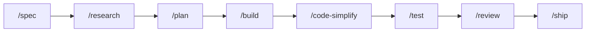

# vibe-agent

A shared kit of agent skills, slash commands, hooks, and a small Go program (`vibe-agent`) that other git repos can attach. Product rules stay in each repo's own `AGENTS.md`.

## Get started

You need `git` and `curl`. You only need Go if you build `vibe-agent` from source. Some hooks call `python3` (3.8+, stdlib). On Windows, turn off the Microsoft Store `python3` alias or those hooks fail with no useful error.

| What you want | PowerShell | Bash |
|---|---|---|
| Commands on your PATH (`vibe-goal`, `vibe-agent`, …) | `powershell -ExecutionPolicy Bypass -File scripts/install-global.ps1` | `sh scripts/install-global.sh` |
| Wire this checkout (`.claude`, `.cursor`, `.opencode`) | `powershell -ExecutionPolicy Bypass -File scripts/link-ai-agents.ps1` | `bash scripts/link-ai-agents.sh` |

In a **consumer** repo that keeps this kit at `.vibe-agent`:

```bash
bash .vibe-agent/scripts/link-ai-agents.sh --workspace "$PWD" --assets "$PWD/.vibe-agent/.ai-agents"
```

Then run `vibe-agent doctor` until it says OK.

## Web UI

Open the local control plane UI:

```bash
vibe-agent web --open
```

This starts a local server at `http://127.0.0.1:3080/` where you can manage sessions, compose prompts, and inspect run state. Add `--port 9090` to change the port. The UI is local-only and does not expose anything to the network. More flags: [`runtime/README.md`](runtime/README.md).

## How to type a command

Claude Code, Cursor, and opencode use `/`. Codex CLI uses `$`. A **global** install adds the `vibe-` prefix; a **workspace** install does not.

| Tool | Global | Workspace |
|---|---|---|
| Claude Code, Cursor, opencode | `/vibe-review` | `/review` |
| Codex CLI | `$vibe-review` | `$review` |

Codex CLI does not load custom `/prompts`. This kit installs those as skills. See [`.ai-agents/AUTHORING.md`](.ai-agents/AUTHORING.md).

## Work one step at a time

Use these slash commands when you want to run each stage yourself.



| Command | What it does |
|---|---|
| `/spec` | Write the work spec first. |
| `/research` | Gather cited evidence. Skip if the repo already has the facts. |
| `/plan` | Turn an approved spec into ordered tasks. |
| `/build` | Implement one planned task on its own branch. Needs the runtime. Never merges to `main`. |
| `/code-simplify` | Cut complexity with tests still green. |
| `/test` | Start from a failing test, or run focused proof. Needs the runtime. |
| `/review` | Check a diff from five angles. Needs the runtime. |
| `/ship` | Return GO or NO-GO. You still approve the merge. Needs the runtime. |

`/design` is extra when the change is UI. `/analyze` and `/investigate` are extra when you need more than one research pass. Full list: [`.ai-agents/commands/ROUTER.md`](.ai-agents/commands/ROUTER.md).

## One prompt for the whole sequence

`/goal` (global: `/vibe-goal`) is the same sequence, driven by the runtime graph. Use it when you have an outcome, not a one-file edit.

```text
/goal Add host token counts to the Chat toolbar.
```

It will not merge to `main` unless you say so. Rules: [`.ai-agents/commands/goal.md`](.ai-agents/commands/goal.md).

## Install as a plugin

This repo ships plugin manifests so GenAI tools can discover skills, commands, hooks, and rules from the GitHub repo. The plugin gives you the agent workflow assets. The Go runtime binary (`vibe-agent`) needs a separate install -- see [Get started](#get-started).

### Claude Code

```bash
/plugin marketplace add ducnd58233/vibe-agent
/plugin install vibe-agent@vibe-agent
```

After installing, run the runtime install separately:

```bash
bash "${CLAUDE_PLUGIN_ROOT}/scripts/install-runtime.sh"
```

### Cursor

```
/add-plugin https://github.com/ducnd58233/vibe-agent
```

For local development or to avoid the [known stale-cache issue](https://forum.cursor.com/t/add-plugin-github-imports-can-get-stuck-on-stale-plugin-versions/163895), clone instead:

```bash
git clone https://github.com/ducnd58233/vibe-agent ~/.cursor/plugins/local/vibe-agent
```

### Codex CLI

```bash
codex plugin marketplace add ducnd58233/vibe-agent
codex plugin add vibe-agent@vibe-agent
```

Or browse with `/plugins` inside the TUI after adding the marketplace.

### Manual (any tool)

Clone this repo as `.vibe-agent` inside your project and run the link script:

```bash
git clone https://github.com/ducnd58233/vibe-agent .vibe-agent
bash .vibe-agent/scripts/link-ai-agents.sh --workspace "$PWD" --assets "$PWD/.vibe-agent/.ai-agents"
```

### What the plugin includes vs. what it does not

| Included in plugin | Needs separate install |
|---|---|
| Skills (`.ai-agents/skills/`) | `vibe-agent` binary (Go runtime) |
| Commands (`.ai-agents/commands/`) | |
| Hooks (`.ai-agents/hooks/`) | |
| Rules (`.cursor/rules/` for Cursor) | |
| Delivery graphs (`.ai-agents/graphs/`) | |

Commands that need the runtime (`/goal`, `/build`, `/test`, `/review`, `/ship`) will refuse to run until the binary is on PATH.

## Where to edit

Edit [`.ai-agents/`](.ai-agents). `.claude/`, `.cursor/`, `.codex/`, `.opencode/`, and `.agents/` are generated. Clone and authoring: [`.ai-agents/AUTHORING.md`](.ai-agents/AUTHORING.md).
