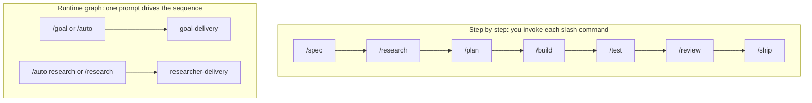
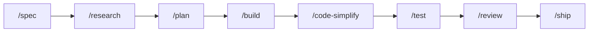
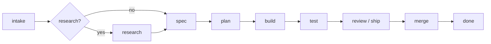
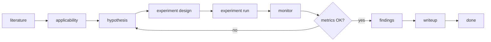

# vibe-agent

Shared agent skills, slash commands, hooks, and a Go runtime (`vibe-agent`) that consumer repos mount under `.vibe-agent/`. Domain rules live in each repo's own `AGENTS.md`.

## Install

You need `git` and `curl`. Go is only required to build the runtime from source. Some hooks call `python3` (3.8+, stdlib). On Windows, disable the Microsoft Store `python3` alias or those hooks fail silently.

There are two install shapes, and they're not alternatives — most setups end up using both:

| | Global | Workspace |
|---|---|---|
| What it is | One shared copy for the whole machine | A copy mounted inside one repo — think git submodule or vendored subfolder, not a system package |
| Where it lands | `~/.vibe-agent`, `~/.claude/skills`, … | `.ai-agents/` inside whichever repo it's linked into |
| Commands | Prefixed: `/vibe-goal`, `$vibe-goal` | Unprefixed: `/goal`, `$goal` |
| Followed by | Every project on the machine | Only the repo it's linked into |
| Run it | Once per machine | Once per repo that should carry its own copy of the assets, permissions, and hooks — including this repo, if you're working on the toolkit itself |

| Goal | PowerShell | Bash |
|---|---|---|
| Global: put commands on PATH (`vibe-goal`, `vibe-agent`, …) | `powershell -ExecutionPolicy Bypass -File scripts/install-global.ps1` | `sh scripts/install-global.sh` |
| Workspace: link *this* checkout (`.claude`, `.cursor`, `.opencode`) | `powershell -ExecutionPolicy Bypass -File scripts/link-ai-agents.ps1` | `bash scripts/link-ai-agents.sh` |
| Third-party community skills (one host or all four) | see [AUTHORING.md — Third-party Agent Skills](.ai-agents/AUTHORING.md#third-party-agent-skills-not-this-toolkit) (`vibe-agent skills add`) | same |

### Workspace install in another repo

To use vibe-agent from a product repo without vendoring it, mount this toolkit as a git submodule at a
path of your choosing (`.vibe-agent/` below), then run the *same* workspace link script from the row
above, pointed at the consumer repo instead of at itself:

```bash
git submodule add git@github.com:ducnd58233/vibe-agent.git .vibe-agent   # once, from the consumer repo root
bash .vibe-agent/scripts/link-ai-agents.sh --workspace "$PWD" --assets "$PWD/.vibe-agent/.ai-agents"
vibe-agent doctor   # repeat until OK
```

`--workspace` is the consumer repo's root, where `.claude`, `.cursor`, and friends get written.
`--assets` always points at `<toolkit-root>/.ai-agents`, wherever the toolkit is mounted. The consumer
repo stays its own repository and the source of product code; vibe-agent only supplies the shared
assets, the same way a submodule supplies shared library code without becoming part of your app.

## How commands look in your host

Claude Code, Cursor, and opencode use `/`. Codex CLI uses `$`. A global install adds the `vibe-` prefix; a workspace install does not.

| Tool | Global example | Workspace example |
|---|---|---|
| Claude Code, Cursor, opencode | `/vibe-goal` | `/goal` |
| Codex CLI | `$vibe-goal` (skill) | `$goal` |

Codex does not load custom `/prompts`; this kit installs commands as skills. Authoring and clone steps: [`.ai-agents/AUTHORING.md`](.ai-agents/AUTHORING.md). Full command list: [`.ai-agents/commands/ROUTER.md`](.ai-agents/commands/ROUTER.md).

## Supported coding hosts

The runtime hooks session start, prompt submit, pre-tool gates, post-tool journaling, and stop for every host below. Delivery commands (`/goal`, `/build`, `/test`, `/ship`, `/auto`) need the `vibe-agent` binary on PATH; hook wiring alone is not enough.

| Host | Binary | Hook config | Status |
|---|---|---|---|
| Claude Code | `claude` | `.claude/settings.json` | Verified |
| Cursor | `cursor-agent` | `.cursor/hooks.json` | Verified |
| Codex CLI | `codex` | `.codex/config.toml` | Verified |
| opencode | `opencode` | `opencode.json` | Verified |
| Google Antigravity | `antigravity` | `.agents/hooks.json` | Hook wiring shipped; payload fields UNVERIFIED until observed on a live host |
| Kimi | `kimi` | `.kimi/hooks.toml` (merge into `~/.kimi/config.toml`) | Hook wiring shipped; Kimi reads user config only |
| Muse | `muse` | `.muse/hooks.json` | Hook wiring shipped; run `muse hooks trust` after install |

`bash scripts/link-ai-agents.sh` creates Antigravity, Kimi, and Muse hook stubs when those files are missing. `vibe-agent doctor` scans all seven configs and reports wiring status. Generated hook contracts: [`.ai-agents/references/host-hook-contracts.md`](.ai-agents/references/host-hook-contracts.md).

Codex and Antigravity also get command skills under `.agents/skills/` (Agent Skills layout). Cursor and Claude keep commands under their own generated views.

## Three ways to work

Pick one path. They compose the same assets; what changes is who drives each gate and which runtime graph starts.



### Step by step (you run each phase)

Use individual slash commands when you want to stop and review between stages.



Skip `/research` when the repo already has the facts. `/code-simplify` is optional. `/build` through `/ship` need the runtime.

| Command | Role |
|---|---|
| `/spec` | Write the spec. |
| `/research` | Citation-first digest (see [Research](#research) below). |
| `/plan` | Tasks from an approved spec. |
| `/build` | One planned task on its own branch. Needs the runtime. Never merges to `main`. |
| `/test`, `/review`, `/ship` | Proof, review, merge gate. Need the runtime. |

`/design`, `/analyze`, and `/investigate` are optional when the work needs extra passes.

### One outcome (`/goal`)

Same delivery pipeline as the step-by-step list, but the runtime graph walks the sequence and pauses at checkpoints.



Human gates on spec and plan under `/goal`; `/auto` can skip them when docs pass structural checks.

```text
/goal Add host token counts to the Chat toolbar.
```

The host agent runs `vibe-agent goal "<your text>"`. Slug and graph are derived; do not pass `--goal`, `--graph`, or `--slug`. Rules: [`.ai-agents/commands/goal.md`](.ai-agents/commands/goal.md).

### Unattended (`/auto`)

Same graphs and checks as `/goal`, but approval gates close on evidence instead of waiting for you. Requires the runtime and a workspace opt-in file.

```bash
vibe-agent auto init                              # writes .agent-state/auto.yaml (merge: false)
vibe-agent auto "Add webhook idempotency"         # goal-delivery
vibe-agent auto research "Compare RAG chunking"   # researcher-delivery
```

| Gate | `/goal` | `/auto` |
|---|---|---|
| Spec and plan | You approve | Skipped when the docs pass structural checks |
| Merge to `main` | You approve | Only if `auto.yaml` says `merge: true` and CI, tests, lint, and `/ship` already pass |
| Danger list (migrations, prod writes, credentials, …) | You decide | Stops every time |

No opt-in file, or `merge: false`, means auto stops at a green PR and you merge manually. Rules: [`.ai-agents/commands/auto.md`](.ai-agents/commands/auto.md).

## Research

The runtime chooses the graph from the **command name**, not from words like "research" inside your prompt.



`/research` and `/auto research` use this graph. `/goal` and plain `/auto` use goal-delivery (diagram above) instead; research there is at most one phase before spec.

| Intent | Slash (global) | Host runs | Graph |
|---|---|---|---|
| Cited digest; you approve applicability and design | `/vibe-research "<topic>"` | `vibe-agent research "<topic>"` | `researcher-delivery` |
| Literature, experiment, metric loop (unattended) | `/vibe-auto research "<topic>"` | `vibe-agent auto research "<topic>"` | `researcher-delivery` |
| Research as one phase, then spec, build, and PR | `/vibe-auto "<outcome>"` | `vibe-agent auto "<outcome>"` | `goal-delivery` |

Examples:

```text
/vibe-research Chunking strategies for RAG on legal PDFs

/vibe-auto research Compare embedding models; loop until recall@10 >= 0.85

/vibe-auto Add a small LLM inference module: research quantization, spec, implement, test, open PR
```

The third example starts **goal-delivery** (optional research node, then spec and ship). Only the second runs the experiment monitor and `experiment/METRICS.json` loop that can route back to hypothesis.

More: [`.ai-agents/commands/research.md`](.ai-agents/commands/research.md), graph [`.ai-agents/graphs/researcher-delivery.yaml`](.ai-agents/graphs/researcher-delivery.yaml).

## Watch a run

```bash
vibe-agent run status --slug <slug>
vibe-agent web --open    # http://127.0.0.1:1411/, local only
```

Runtime flags and internals: [`runtime/README.md`](runtime/README.md).

## Where to edit

Edit sources under [`.ai-agents/`](.ai-agents). Paths like `.claude/`, `.cursor/`, and `.codex/` are generated views; re-run the link script after changes.
