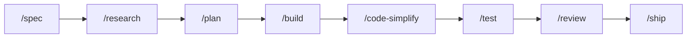

# vibe-agent

A shared kit of agent skills, slash commands, hooks, and a small Go program (`vibe-agent`) that other git repos can attach. Product rules stay in each repo's own `AGENTS.md`.

## Get started

You need `git` and `curl`. You only need Go if you build `vibe-agent` from source. Some hooks call `python3` (3.8+, stdlib). On Windows, turn off the Microsoft Store `python3` alias or those hooks fail with no useful error.

| What you want | PowerShell | Bash |
|---|---|---|
| Commands on your PATH (`vibe-goal`, `vibe-agent`, …) | `powershell -ExecutionPolicy Bypass -File scripts/install-global.ps1` | `sh scripts/install-global.sh` |
| Wire this checkout (`.claude`, `.cursor`, `.opencode`) | `powershell -ExecutionPolicy Bypass -File scripts/link-ai-agents.ps1` | `bash scripts/link-ai-agents.sh` |

In a **consumer** repo that keeps this kit at `.vibe-agent`:

```bash
bash .vibe-agent/scripts/link-ai-agents.sh --workspace "$PWD" --assets "$PWD/.vibe-agent/.ai-agents"
```

Then run `vibe-agent doctor` until it says OK. Open the local UI with `vibe-agent web --open` (only `http://127.0.0.1:3080/`). Flags and install options: [`runtime/README.md`](runtime/README.md).

## How to type a command

Claude Code, Cursor, and opencode use `/`. Codex CLI uses `$`. A **global** install adds the `vibe-` prefix; a **workspace** install does not.

| Tool | Global | Workspace |
|---|---|---|
| Claude Code, Cursor, opencode | `/vibe-review` | `/review` |
| Codex CLI | `$vibe-review` | `$review` |

Codex CLI does not load custom `/prompts`. This kit installs those as skills. See [`.ai-agents/AUTHORING.md`](.ai-agents/AUTHORING.md).

## Work one step at a time

Use these slash commands when you want to run each stage yourself.



| Command | What it does |
|---|---|
| `/spec` | Write the work spec first. |
| `/research` | Gather cited evidence. Skip if the repo already has the facts. |
| `/plan` | Turn an approved spec into ordered tasks. |
| `/build` | Implement one planned task on its own branch. Needs the runtime. Never merges to `main`. |
| `/code-simplify` | Cut complexity with tests still green. |
| `/test` | Start from a failing test, or run focused proof. Needs the runtime. |
| `/review` | Check a diff from five angles. Needs the runtime. |
| `/ship` | Return GO or NO-GO. You still approve the merge. Needs the runtime. |

`/design` is extra when the change is UI. `/analyze` and `/investigate` are extra when you need more than one research pass. Full list: [`.ai-agents/commands/ROUTER.md`](.ai-agents/commands/ROUTER.md).

## One prompt for the whole sequence

`/goal` (global: `/vibe-goal`) is the same sequence, driven by the runtime graph. Use it when you have an outcome, not a one-file edit.

```text
/goal Add host token counts to the Chat toolbar.
```

It will not merge to `main` unless you say so. Rules: [`.ai-agents/commands/goal.md`](.ai-agents/commands/goal.md).

## Install as a plugin

Install vibe-agent as a plugin in your AI coding tool. If you use more than one tool, install separately for each.

### Claude Code

```
/plugin install vibe-agent@claude-plugins-official
```

Or from the vibe-agent marketplace:

```
/plugin marketplace add ducnd58233/vibe-agent-marketplace
/plugin install vibe-agent@vibe-agent-marketplace
```

### Cursor

```
/add-plugin vibe-agent
```

Or search for "vibe-agent" in the Cursor plugin marketplace.

### Codex CLI

```
/plugins
```

Search for "vibe-agent" and select Install Plugin.

### OpenCode

```
Fetch and follow instructions from https://raw.githubusercontent.com/ducnd58233/vibe-agent/refs/heads/main/.opencode/INSTALL.md
```

### Manual (any tool)

Clone this repo as `.vibe-agent` inside your project and run the link script:

```bash
git clone https://github.com/ducnd58233/vibe-agent .vibe-agent
bash .vibe-agent/scripts/link-ai-agents.sh --workspace "$PWD" --assets "$PWD/.vibe-agent/.ai-agents"
```

## Plugin manifests

The link scripts generate plugin manifests so GenAI tools can discover this kit as an installable plugin. After running the link script, the following files exist:

| File | Target tool |
|---|---|
| `plugin.json` (root) | Generic [Agent Plugins](https://agent-plugins.org/) spec |
| `.claude-plugin/plugin.json` + `marketplace.json` | [Claude Code](https://docs.anthropic.com/en/docs/claude-code) |
| `.cursor-plugin/plugin.json` | [Cursor](https://docs.cursor.com/) |
| `.codex-plugin/plugin.json` | [Codex CLI](https://github.com/openai/codex) |

These files are generated, not hand-edited. To regenerate after changing `.ai-agents/`:

```bash
bash scripts/link-ai-agents.sh          # Linux / macOS / Git Bash
powershell -ExecutionPolicy Bypass -File scripts/link-ai-agents.ps1  # Windows
```

### What is a plugin?

A plugin is a manifest that tells an AI coding tool where to find skills, commands, rules, and hooks so they load automatically when the tool opens a project. Instead of copying instructions into each tool's config, the plugin points to the canonical `.ai-agents/` tree.

### Real-world plugin examples

- [Figma Agent Toolkit](https://github.com/nichochar/figma-mcp-write-server) - MCP server plugin for Figma design-to-code workflows
- [Supabase MCP](https://github.com/supabase-community/supabase-mcp) - database and auth plugin for Supabase projects
- [Stripe Agent Toolkit](https://github.com/stripe/agent-toolkit) - payment integration plugin for Stripe APIs
- [Sentry MCP](https://github.com/getsentry/sentry-mcp) - error monitoring plugin connecting AI tools to Sentry
- [Linear MCP](https://github.com/linear/linear-mcp) - project management plugin for Linear issues and cycles

## Where to edit

Edit [`.ai-agents/`](.ai-agents). `.claude/`, `.cursor/`, `.codex/`, `.opencode/`, and `.agents/` are generated. Clone and authoring: [`.ai-agents/AUTHORING.md`](.ai-agents/AUTHORING.md).
