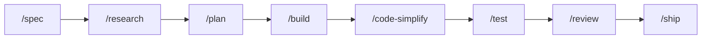

# vibe-agent

A shared kit of agent skills, slash commands, hooks, and a small Go program (`vibe-agent`) that other git repos can attach. Product rules stay in each repo's own `AGENTS.md`.

## Get started

You need `git` and `curl`. You only need Go if you build `vibe-agent` from source. Some hooks call `python3` (3.8+, stdlib). On Windows, turn off the Microsoft Store `python3` alias or those hooks fail with no useful error.

| What you want | PowerShell | Bash |
|---|---|---|
| Commands on your PATH (`vibe-goal`, `vibe-agent`, …) | `powershell -ExecutionPolicy Bypass -File scripts/install-global.ps1` | `sh scripts/install-global.sh` |
| Wire this checkout (`.claude`, `.cursor`, `.opencode`) | `powershell -ExecutionPolicy Bypass -File scripts/link-ai-agents.ps1` | `bash scripts/link-ai-agents.sh` |

In a **consumer** repo that keeps this kit at `.vibe-agent`:

```bash
bash .vibe-agent/scripts/link-ai-agents.sh --workspace "$PWD" --assets "$PWD/.vibe-agent/.ai-agents"
```

Then run `vibe-agent doctor` until it says OK.

## Web UI

Open the local control plane UI:

```bash
vibe-agent web --open
```

This starts a local server at `http://127.0.0.1:3080/` where you can manage sessions, compose prompts, and inspect run state. Add `--port 9090` to change the port. The UI is local-only and does not expose anything to the network. More flags: [`runtime/README.md`](runtime/README.md).

## How to type a command

Claude Code, Cursor, and opencode use `/`. Codex CLI uses `$`. A **global** install adds the `vibe-` prefix; a **workspace** install does not.

| Tool | Global | Workspace |
|---|---|---|
| Claude Code, Cursor, opencode | `/vibe-review` | `/review` |
| Codex CLI | `$vibe-review` | `$review` |

Codex CLI does not load custom `/prompts`. This kit installs those as skills. See [`.ai-agents/AUTHORING.md`](.ai-agents/AUTHORING.md).

## Work one step at a time

Use these slash commands when you want to run each stage yourself.



| Command | What it does |
|---|---|
| `/spec` | Write the work spec first. |
| `/research` | Gather cited evidence. Skip if the repo already has the facts. |
| `/plan` | Turn an approved spec into ordered tasks. |
| `/build` | Implement one planned task on its own branch. Needs the runtime. Never merges to `main`. |
| `/code-simplify` | Cut complexity with tests still green. |
| `/test` | Start from a failing test, or run focused proof. Needs the runtime. |
| `/review` | Check a diff from five angles. Needs the runtime. |
| `/ship` | Return GO or NO-GO. You still approve the merge. Needs the runtime. |

`/design` is extra when the change is UI. `/analyze` and `/investigate` are extra when you need more than one research pass. Full list: [`.ai-agents/commands/ROUTER.md`](.ai-agents/commands/ROUTER.md).

## One prompt for the whole sequence

`/goal` (global: `/vibe-goal`) is the same sequence, driven by the runtime graph. Use it when you have an outcome, not a one-file edit.

```text
/goal Add host token counts to the Chat toolbar.
```

It will not merge to `main` unless you say so. Rules: [`.ai-agents/commands/goal.md`](.ai-agents/commands/goal.md).

## The same sequence, unattended

`/auto` is `/goal` with the approval gates answered by evidence instead of by you. Same graph, same
checks, same refusals. What changes is who confirms.

| | `/goal` | `/auto` |
|---|---|---|
| Spec and plan | You approve each one | Passed on its own, unless the objective cannot be specified without guessing |
| Merge to `main` | You approve, every time | Only with a workspace opt-in, and only when CI, the tests, the linter, and `/ship` all already say yes |
| Anything on the danger list | You approve | Stops. Migrations, data destruction, production writes, credential changes, history rewrites, infrastructure destruction, publishing |

Turn it on once per checkout, and answer the question it writes:

```bash
vibe-agent auto init     # writes .agent-state/auto.yaml with merge: false
```

No file, or `merge: false`, means auto stops at a green pull request and you merge it. Absence is a
no; nothing infers the answer.

Parts of `/auto` are still being built. The opt-in, the checks, and the danger gate work today; the
graph edges that skip the approval gates do not, so until they land use `/goal`. What the finished
mode may and may not decide is written down now, in
[`.ai-agents/commands/auto.md`](.ai-agents/commands/auto.md), so the contract is reviewable before
the machinery arrives.


## Where to edit

Edit [`.ai-agents/`](.ai-agents). `.claude/`, `.cursor/`, `.codex/`, `.opencode/`, and `.agents/` are generated. Clone and authoring: [`.ai-agents/AUTHORING.md`](.ai-agents/AUTHORING.md).
